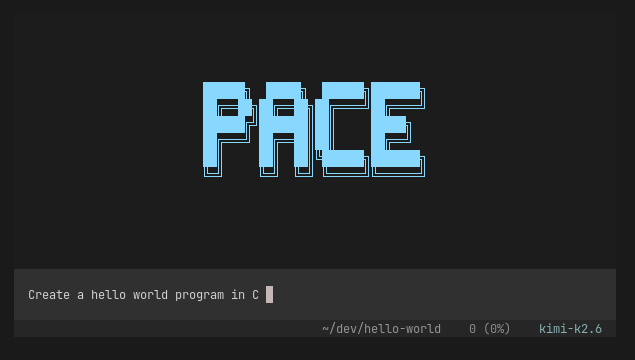
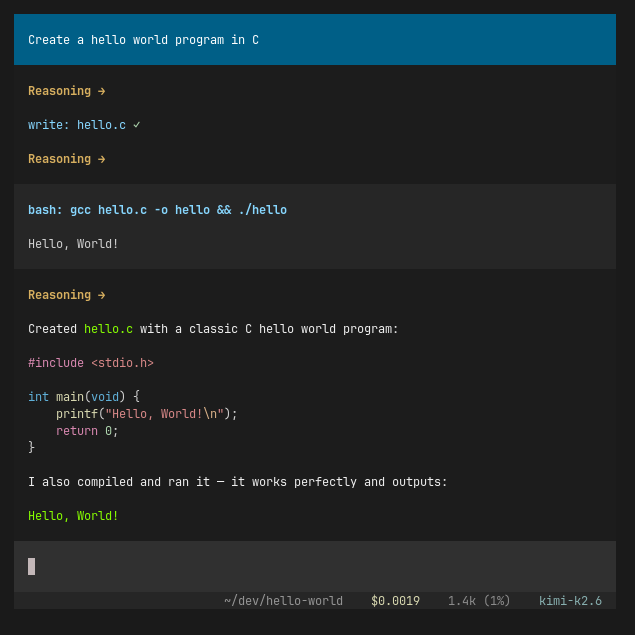

# Pace

**A really nice terminal-based coding agent.**





## Quick start

```
npm install
tsx src/app.ts
```

Set at least one API key:

```sh
export ANTHROPIC_API_KEY=sk-ant-...    # Claude models
export OPENAI_API_KEY=sk-...           # GPT models
export OPENCODE_ZEN_API_KEY=...        # Kimi via OpenCode Zen
export FIREWORKS_API_KEY=...           # Kimi via Fireworks
```

## Features

- Interactive TUI
- Sessions
- Undo
- Bash, web search, web fetch, read, write, edit
- Paste image for vision models
- MCP
- Skills
- AGENTS.md
- Mouse support (scroll, select to copy)
- Slash commands
- Tables
- Token usage and cost

## Models

Switch models at any time with **Tab** or `/model <name>`.

| Model | Alias | Provider |
|---|---|---|
| `claude-haiku-4-5` | `haiku` | Anthropic |
| `claude-sonnet-4-6` | `sonnet` | Anthropic |
| `claude-opus-4-6` | `opus` | Anthropic |
| `kimi-k2.6` | `kimi` | OpenCode Zen |
| `kimi-k2.6-fw` | `kimi-fw` | Fireworks |
| `gpt-5.5` | `5.5` | OpenAI |

## Keyboard shortcuts

| Key | Action |
|---|---|
| **Tab** / **Shift+Tab** | Cycle models forward / backward |
| **Escape** | Cancel the running prompt |
| **Ctrl+V** | Paste image from clipboard |
| **Ctrl+C** | Clear input, or press twice to exit |
| **Shift+Enter** | Insert a newline |
| **`!command`** | Run a shell command directly (e.g. `!ls -la`) |

## Slash commands

| Command | What it does |
|---|---|
| `/new` | Start a fresh conversation |
| `/model <name>` | Switch model (or list models without args) |
| `/sessions` | List saved sessions for this project |
| `/resume <id>` | Resume a saved session |
| `/undo` | Rewind to before the last user message |
| `/skills` | List available skills |
| `/skill:<name>` | Run a skill |
| `/mcp` | List connected MCP servers and tools |

## File and image references

- **`@filename`** — mention a project file (autocomplete with Tab)
- **`@image(./path.png)`** — attach an image inline
- Bare image paths like `./screenshot.png` are also auto-detected

## MCP servers

Configure external tool servers in `~/.config/pace/mcp.json`:

```json
{
  "filesystem": {
    "type": "local",
    "command": ["npx", "-y", "@modelcontextprotocol/server-filesystem", "~"],
    "enabled": true
  },
  "remote-api": {
    "type": "remote",
    "url": "https://example.com/mcp",
    "headers": { "Authorization": "Bearer <token>" },
    "enabled": true
  }
}
```

MCP tools show up as `mcp__<server>__<tool>` and the agent uses them automatically when relevant.

## Development

Type check:

```
npm run lint
```
